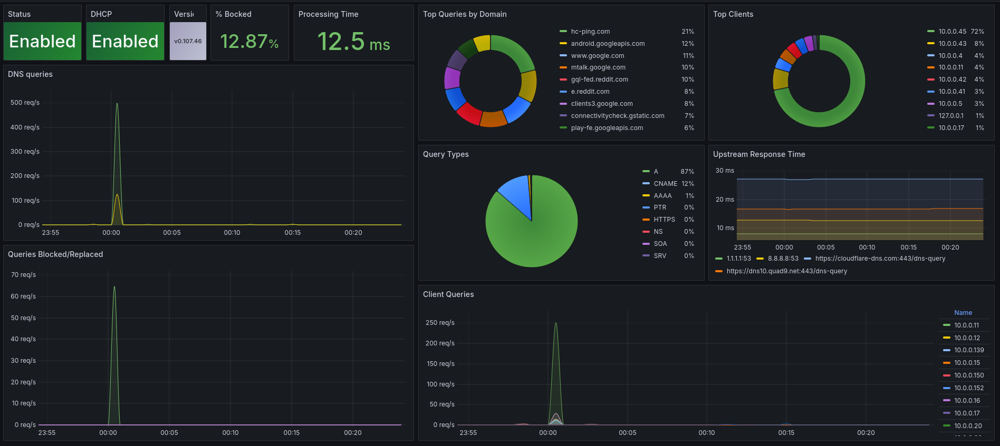

# AdGuard Home Prometheus Exporter

This is a Prometheus exporter for [AdGuard Home](https://github.com/AdguardTeam/AdGuardHome).



## Installation

### Using Docker

You can run it using the following example and pass configuration environment variables:

```
$ docker run \
  -e 'ADGUARD_SERVERS=http://192.168.1.2' \
  -e 'ADGUARD_USERNAMES=demo' \
  -e 'ADGUARD_PASSWORDS=mypassword' \
  -e 'INTERVAL=15s' \ # Optional, defaults to 30s
  -p 9618:9618 \
  ghcr.io/henrywhitaker3/adguard-exporter:latest
```

A single instance of adguard-exporter can monitor multiple AdGuard Home instances.
To do so, you can specify a list of servers, usernames and passwords by separating them with commas in their respective environment variable:

```
$ docker run \
  -e 'ADGUARD_SERVERS=http://192.168.1.2,http://192.168.1.3,http://192.168.1.4"' \
  -e "ADGUARD_USERNAMES=$USERNAME1,$USERNAME2,$USERNAME3" \
  -e "ADGUARD_PASSWORDS=$PASSWORD1,$PASSWORD2,$PASSWORD3" \
  -p 9618:9618 \
  ghcr.io/henrywhitaker3/adguard-exporter:latest
```

### Env Vars

| Variable | Description | Required | Default |
| --- | --- | --- | --- |
| `ADGUARD_SERVERS` | The servers you want the exporter to scrape. Must include the scheme `http(s)` and port if non-standard. | `True` | |
| `ADGUARD_USERNAMES` | The username to connect to the adguard api with. Must be in the same order as `ADGUARD_SERVERS` if scraping multiple instances. | `True` | |
| `ADGUARD_PASSWORDS` | The password to connect to the adguard api with. Must be in the same order as `ADGUARD_SERVERS` if scraping multiple instances. | `True` | |
| `INTERVAL` | The interval that the exporter scrapes metrics from the server | `False` | `30s` |

## Usage

Once the exporter is running, you also have to update your `prometheus.yml` configuration to let it scrape the exporter:

```yaml
scrape_configs:
  - job_name: 'adguard'
    static_configs:
      - targets: ['localhost:9618']
```

If you want to strip the scheme and port out of the `server` label in the metrics, you can add a relabeling:

```yaml
- action: replace
  sourceLabels: ["server"]
  regex: http(|s):\/\/([0-9]{1,3}\.[0-9]{1,3}\.[0-9]{1,3}\.[0-9]{1,3}).*
  replacement: $2
  targetLabel: server
```

## Available Prometheus metrics

| Metric name                                       | Description                                                       |
| ---                                               | ---                                                               |
| adguard_scrape_errors_total                       | The number of errors scraping a target                            |
| adguard_protection_enabled                        | Whether DNS filtering is enabled                                  |
| adguard_running                                   | Whether adguard is running or not                                 |
| adguard_queries                                   | Total queries processed in the last 24 hours                      |
| adguard_query_types                               | The number of DNS queries by adguard_query_types                  |
| adguard_blocked_filtered                          | Total queries that have been blocked from filter lists            |
| adguard_blocked_safesearch                        | Total queries that have been blocked due to safesearch            |
| adguard_blocked_safebrowsing                      | Total queries that have been blocked due to safebrowsing          |
| adguard_avg_processing_time_seconds               | The average query processing time in seconds                      |
| adguard_avg_processing_time_milliseconds_bucket   | The processing time of queries                                    |
| adguard_top_queried_domains                       | The number of queries for the top domains                         |
| adguard_top_blocked_domains                       | The number of blocked queries for the top domains                 |
| adguard_top_clients                               | The number of queries for the top clients                         |
| adguard_top_upstreams                             | The number of repsonses for the top upstream servers              |
| adguard_top_upstreams_avg_response_time_seconds   | The average response time for each of the top upstream servers    |
| adguard_dhcp_enabled                              | Whether dhcp is enabled                                           |
| adguard_dhcp_leases                               | The dhcp leases                                                   |
